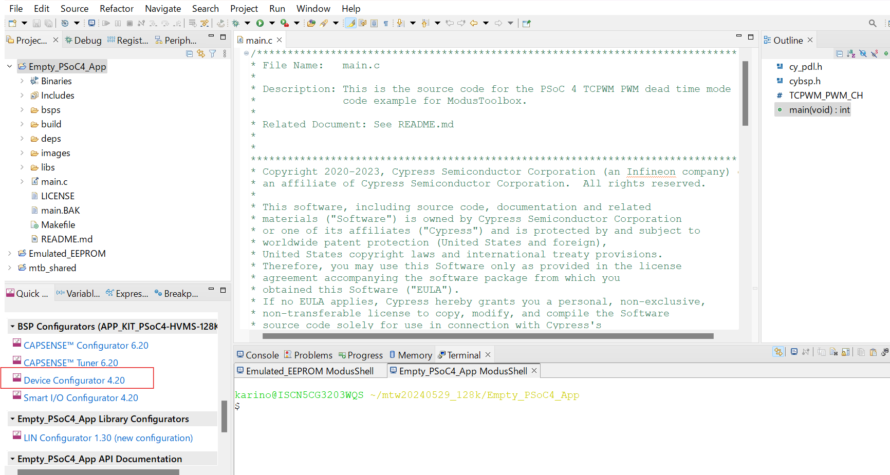
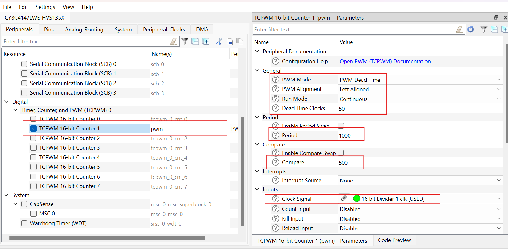
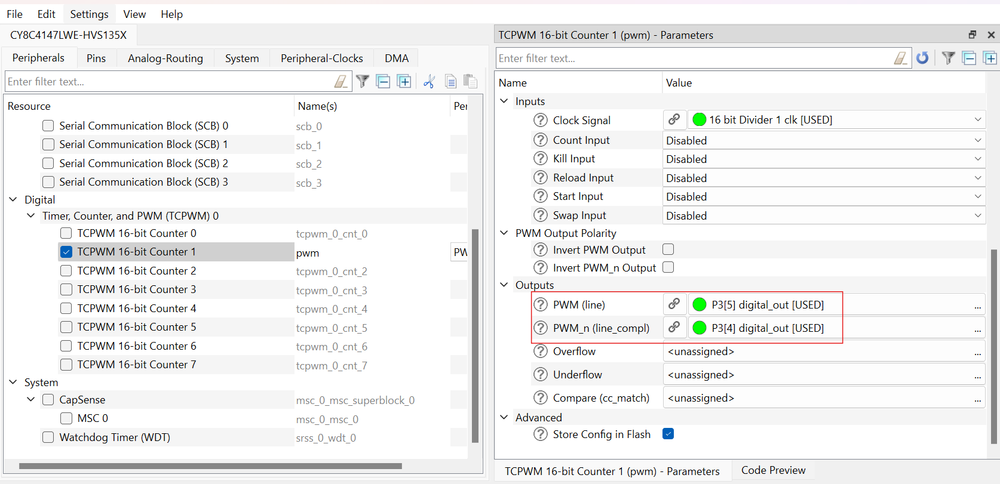
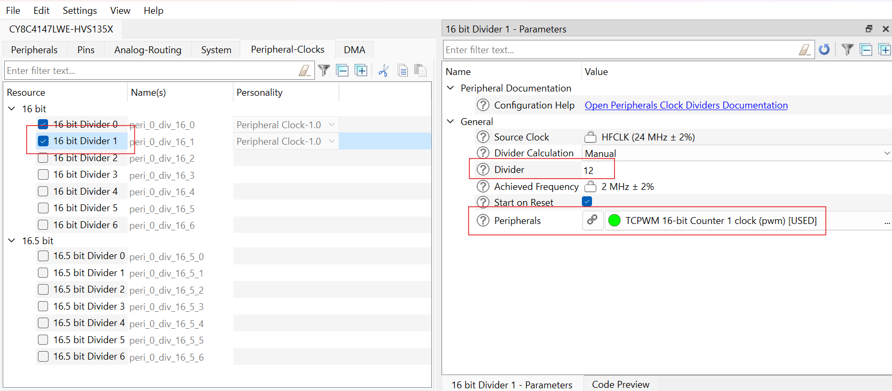
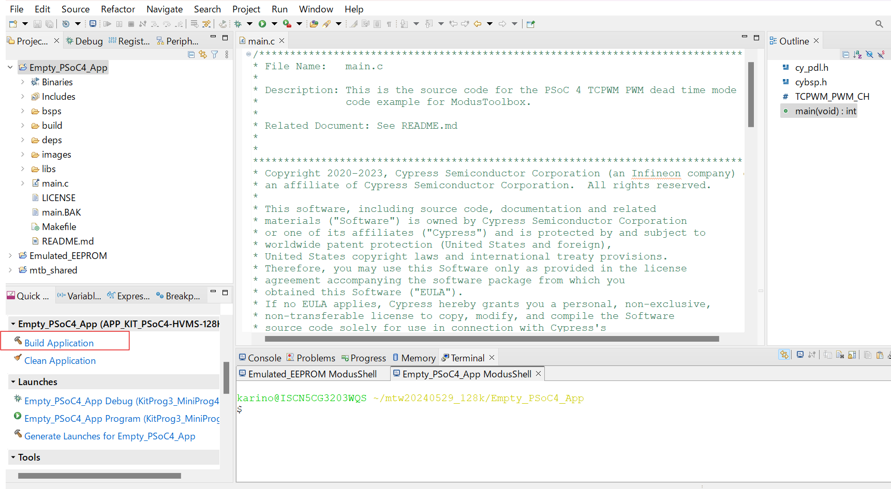
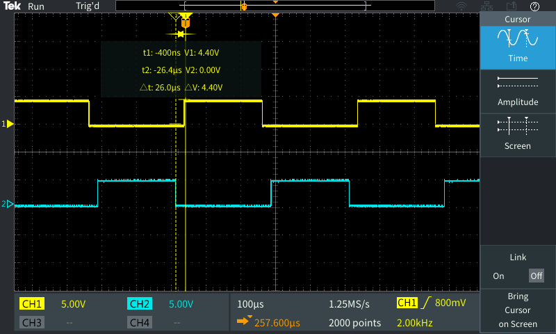
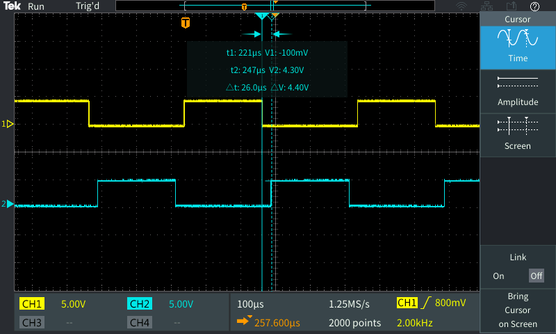

# PSoC&trade;4: TCPWM DT 
**This code example shows TCPWM dead time mode function. As the PWM dead time mode, PWM line pin and PWM complementary line pin output signals based on the 2kHz frequency. The signal is output from the line pin with a delay of 25 us from the rising edge of the 2kHz based PWM and from the complementary line pin with a delay of 25 us from the falling edge.**

## Device
The device used in this code example (CE) is:
- [PSoC&trade; 4 HVMS Series (High Voltage Mixed Signal)](https://www.infineon.com/cms/en/product/microcontroller/32-bit-psoc-arm-cortex-microcontroller/32-bit-psoc-4-hv-arm-cortex-m0/)

## Board
The board used for testing is:
- [KIT_PSoC4-HVMS-128K_LITE](https://www.infineon.com/cms/en/product/evaluation-boards/psoc4_hvms_lite_kit/) 
- [KIT_PSoC4-HVMS-64K_LITE](https://www.infineon.com/cms/en/product/evaluation-boards/psoc4_hvms_lite_kit/)

## Scope of work
The example configures in the TCPWM (Timer, Counter and Pulse Width Modulator) as the PWM dead time mode. In the PWM dead time mode, PWM line pin p3[5] and PWM complementary line pin p3[4] output signals based on the 2kHz frequency. The PWM line pin outputs a waveform with a 25us delay from the rising edge of the base PWM 2kHz and the PWM complementary line pin outputs a waveform with a 25us delay from the falling edge of the base PWM 2kHz.
These signals can be confirmed on an oscilloscope.

## Introduction  

TCPWM block implements a 16 or 32-bit timer, counter, pulse width modulator (PWM), pseudo random PWM, shift register, and quadrature decoder functionality.

The TCPWM block has the following features:

- Supports up to four counter groups (device specific)
- Each counter group consists up to 256 counters (counter group specific)
- Each counter can run in one of seven function modes
- Timer-counter with compare
    - Timer-counter with capture
    - Quadrature decoding
    - Pulse width modulation/stepper motor control (SMC) for pointer instruments
    - PWM with dead time/three-phase motor control (Brushless-DC, BLDC)
    - Pseudo-random PWM
    - Shift register mode
- 16-bit or 32-bit counters (counter group specific)
- Up, down, and up/down counting modes
- Clock prescaling (division by 1, 2, 4, ... 64, 128)
- Up to two capture and compare functions (counter group specific)
- Double buffering of all compare/capture and period registers
- Two output trigger signals for each counter to indicate underflow, overflow, and capture/compare events; they can also  directly be connected with the line output signal
- Supports interrupt on:
    - Terminal Count - Depends on the mode; typically occurs on overflow or underflow
    - Capture/Compare - The count is captured in the capture registers or the counter value equals the value in the compare register

- Integrate board-level Boolean logic functionality into a port
- Ability to pre-process high-speed I/O matrix (HSIOM) input signals from the General Purpose I/O (GPIO) port pins
- Support in all device power modes
- Integrate closely to the I/O pads, providing shortest signal paths with programmability

More details can be found in:
- PSoC4 HVMS 64k/128k LITE Series
  - Technical Reference Manual (TRM)
  - Registers TRM
  - Data Sheet

## Hardware setup
This Code Example has been developed for:
- [KIT_PSoC4-HVMS-64K_LITE](https://www.infineon.com/cms/en/product/evaluation-boards/psoc4_hvms_lite_kit/) 
- [KIT_PSoC4-HVMS-128K_LITE](https://www.infineon.com/cms/en/product/evaluation-boards/psoc4_hvms_lite_kit/) 

**Figure1: KIT_PSoC4-HVMS-128K_LITE**
  

**GPIO pins list**
     <table border="1" style="border-collapse: collapse">
     <thead><tr>
     <th>Board</th><th>TCPWM PWM dead time output pin</th><th>Note</th></tr></thead>
     <tbody>
     <tr><td>PSoC4 HVMS 64k/128k LITE kit</td><td>PWM line P3[5], PWM complementary line P3[4] </td><td>None</td></tr>
     </tbody>
     </table>

## Implementation

In this code example, TCPWM PWM dead time mode is configured. 
In the Device Configurer, set the TCPWM PWM clock to 2MHz. This setting means that PWM one clock cycle is 0.5us. Set PWM MODE to PWM Dead time, PWM Alignment to Left Aligned, and Run Mode to Continuous. Set Dead time to 50 clock cycles (25us).
Also, set the base PWM period to 1000 (500us) and Compare value to 500 (250us), resulting in the PWM Duty of 50%.
The PWM line is output with a delay of 50 clock cycles from the rising edge of the base PWM. The PWM complementary line is output with a delay of 50 clock cycles from the falling edge of the base PWM. For signal output, set the PWM line to pin P3[5] and the PWM complementary line to pin P3[4].

**ModusToolbox™ Device Configurator**

This code example project can be created or imported using ModusToolbox™ IDE. To configure the project in the **Quick Panel**, click on **Device Configurator**    

**Figure2: Device Configurator in the Quick Panel**
  

**Figure3: Configuration TCPWM and PWM dead time mode**
  

**Figure4: Configuration PWM line and PWM complementary line**
  

**Figure5: Configuration Clock**
  

This code example demonstrates PWM dead time mode of the TCPWM. 
This TCPWM outputs signals from the PWM line pin and PWM complementary line pin by setting the PWM dead time mode.

Basically, the TCPWM functions are called. First, initialize the PWM dead time mode by calling the <a href="https://infineon.github.io/mtb-pdl-cat2/pdl_api_reference_manual/html/group__group__tcpwm__functions__pwm.html#ga6440d2a9dc8d85056abd62556bee7f82"><i>Cy_TCPWM_PWM_Init()</i></a> function.
Next, enable PWM with the <a href="https://infineon.github.io/mtb-pdl-cat2/pdl_api_reference_manual/html/group__group__tcpwm__functions__pwm.html#ga802ebf3a49b1056e4bc5b057deb26e49"><i>Cy_TCPWM_PWM_Enable()</i></a> function.
Then, start the PWM dead time mode output by the <a href="https://infineon.github.io/mtb-pdl-cat2/pdl_api_reference_manual/html/group__group__tcpwm__functions__common.html#ga8f4ab67e3946d84d77b54e0375eb0e48"><i>Cy_TCPWM_TriggerReloadOrIndex()</i></a>  function. Then, signals are output in the PWM line pin and PWM complementary line pin. 

- The clock used by TCPWM are reflected in *cybsp_init()* automatically

## Compiling and programming
Before testing this code example:  
- Power the board through the dedicated power connector 
- Connect the board to the PC through the USB interface
- Build the project using the dedicated Build button or by right-clicking the project name and selecting "Build Project"

**Figure6: Build Project in the  Quick Panel**
  

- To program the board, in the **Quick Panel**, scroll down, and click **[Project Name] Program (KitProg3_MiniProg4)**

## Run and Test
For this example, an oscilloscope is needed to monitor to TCPWM PWM dead time mode signal output.

- After programming, the code example starts automatically and outputs signals from the PWM line pin and PWM complementary line pin as the PWM dead time mode.

- Monitor to the signals from the PWM line pin P3[5] and PWM complementary line pin P3[4].

**Figure7: PWM dead time mode in PWM line pin output (yellow)**
  

**Figure8: PWM dead time mode in PWM complementary line pin output (blue)**
  

- PWM line pin P3[5] yellow signal
- PWM complementary line pin P3[4] blue signal

- You can debug the example to step through the code. In the IDE, use the **[Project Name] Debug (KitProg3_MiniProg4)** configuration in the **Quick Panel**. For details, see the "Program and debug" section in the [Eclipse IDE for ModusToolbox™ software user guide](https://www.infineon.com/dgdl/?fileId=8ac78c8c8d2fe47b018e0ea1b42078f2).

## References  

Relevant Application notes are:
- AN235305 - Getting started with PSoC&trade; 4 HVMS family MCUs in ModusToolbox&trade;

ModusToolbox&trade; is available online:
- <https://www.infineon.com/modustoolbox>

Associated PSoC&trade; 4 HVMS MCUs can be found on:
- <https://www.infineon.com/cms/en/product/microcontroller/32-bit-psoc-arm-cortex-microcontroller/32-bit-psoc-4-hv-arm-cortex-m0/>

More code examples can be found on the GIT repository:
- <https://github.com/Infineon/Code-Examples-for-ModusToolbox-Software>

For additional trainings, visit our webpage:  
- <https://www.infineon.com/cms/en/product/microcontroller/32-bit-psoc-arm-cortex-microcontroller/32-bit-psoc-4-hv-arm-cortex-m0/#!trainings>

For questions and support, use the PSoC&trade; 4 HVMS Forum:  
- <https://community.infineon.com/t5/PSoC-4/bd-p/psoc4>

